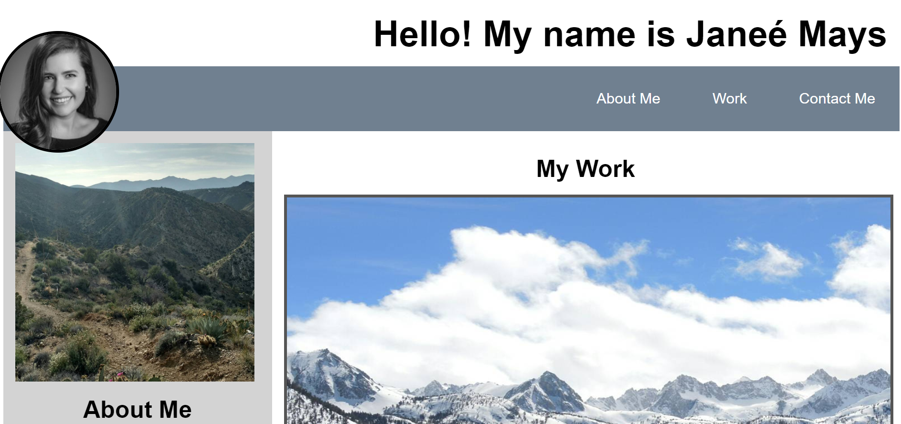
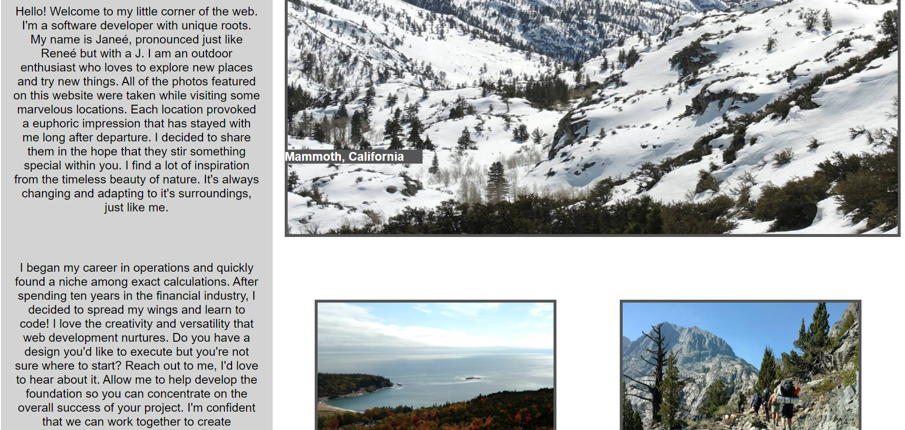
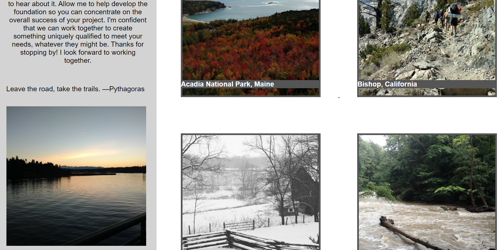
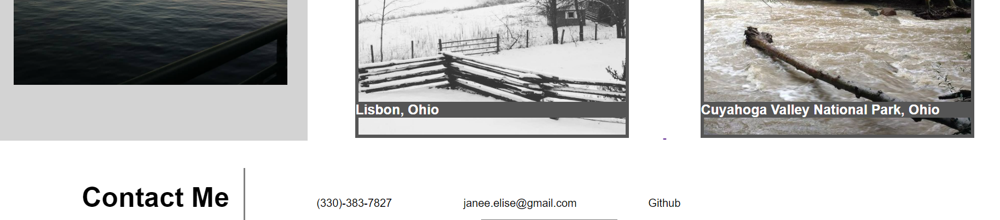

# Janeé Mays Professional Portfolio: Portfolio
Personal professional portfolio which includes work samples and relevant skills

## Description 

  I began this project by browsing other professional portfolios to see what I liked and disliked. It was hard for me to make up my mind as I admittedly enjoyed little snipits of several. In the end, I decided to go with a minimalistic palette which focused mostly on my photos. I chose a 30/70 flex layout, specifically targeting the "About Me" portion to the smaller ratio (I found it really hard to talk about myself). Although I found it relatively straight forward to postion the largest image, I struggled with the bottom four images. First, I could not get them to display in a grid format. Next, when I added a border, I noticed white space around the right and bottom sides of the images. Finally, positioning the text boxes over each image took a lot of trial and error. The last piece of the puzzel was linking each external link to the corresponding images. Also, connecting my GitHub account to the link in the "contact"/footer link. 

https://janee-elise-mays.github.io/janee-mays-professional-portfolio/

